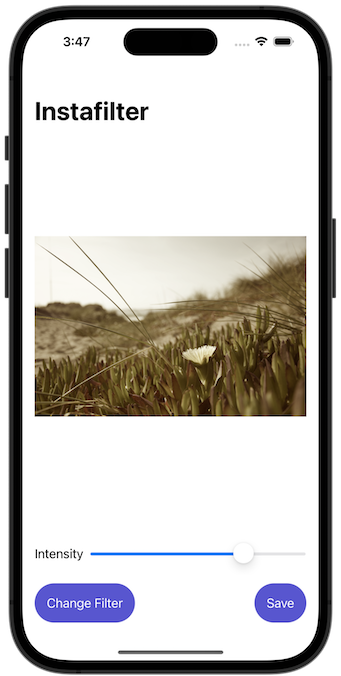
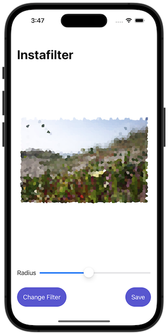

# Project 13 - Instafilter

https://www.hackingwithswift.com/100/swiftui/62

Includes solutions to the [challenges](https://www.hackingwithswift.com/books/ios-swiftui/instafilter-wrap-up).

## Topics

UIKit integration, Core Image, Custom bindings, Action Sheets

## Challenges

From [Hacking with Swift](https://www.hackingwithswift.com/books/ios-swiftui/instafilter-wrap-up):

> 1. Try making the Save button disabled if there is no image in the image view.
> 2. Experiment with having more than one slider, to control each of the input keys you care about. For example, you might have one for radius and one for intensity.
> 3. Explore the range of available Core Image filters, and add any three of your choosing to the app.

## Screenshots

### Light Mode

### Dark Mode

